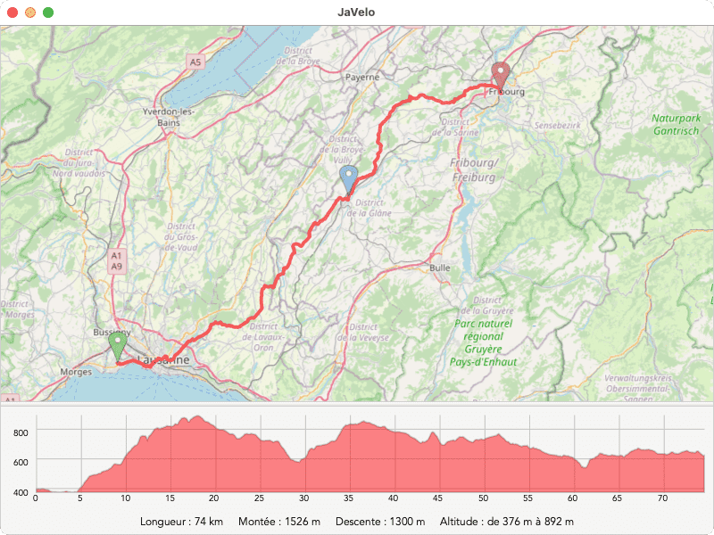

# JaVelo
Planificateur d'itinéraire à vélo en Suisse.

Pour calculer l'itinéraire vélo optimal avec Dijkstra A*, ce projet utilise les données de l'office fédéral de la topographie (swisstopo, modèle altimétrique SwissALTI3D).
Les fonds de cartes sont téléchargés depuis les serveurs OpenStreetMap (OSM).

Ce projet a été fait sur un semestre en Java dans le cadre du cour "CS-108 — Pratique de la programmation orientée-objet"

Lien de la page d'introduction du projet : https://cs108.epfl.ch/archive/22/p/00_introduction.html
